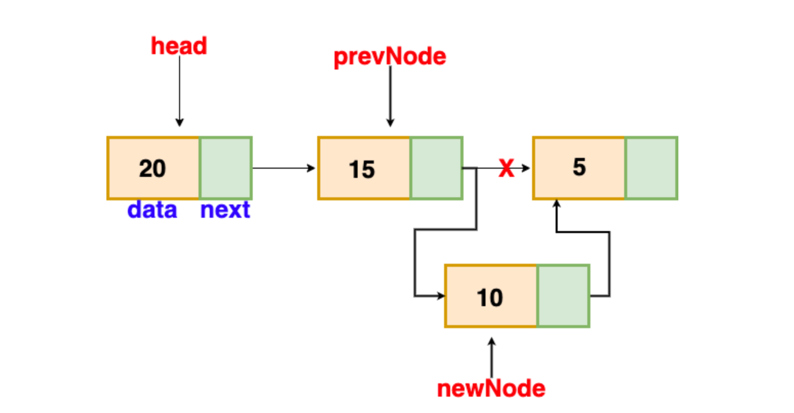

# Backend Developer Simulation

This project demonstrates custom data structures using a linked list implementation.

## QuickPopDataStructure

In the `QuickPopDataStructure`, new data is inserted in descending order, ensuring that the first element always holds the maximum value. This structure allows efficient popping of the maximum value.

- **Push**: \( O(n) \)
  
  
- **Pop**: \( O(1) \)
  
  

## QuickPushDataStructure

In the `QuickPushDataStructure`, new data is always added as the first element, providing a fast push operation. For popping the maximum value, the structure traverses the entire list to find the maximum node.

- **Push**: \( O(1) \)
  
  
- **Pop**: \( O(n) \)
  
  

## Testing

- **Program.cs**: Contains a simple smoke test.
- **UnitTests/DataStructuresUnitTests.cs**: Includes unit tests to validate that:
  - Both structures return the maximum value correctly in `Pop` operations.
  - Both classes can handle any type of object.
  - Both classes are thread-safe, supporting concurrent `Pop` and `Push` operations from multiple threads.
